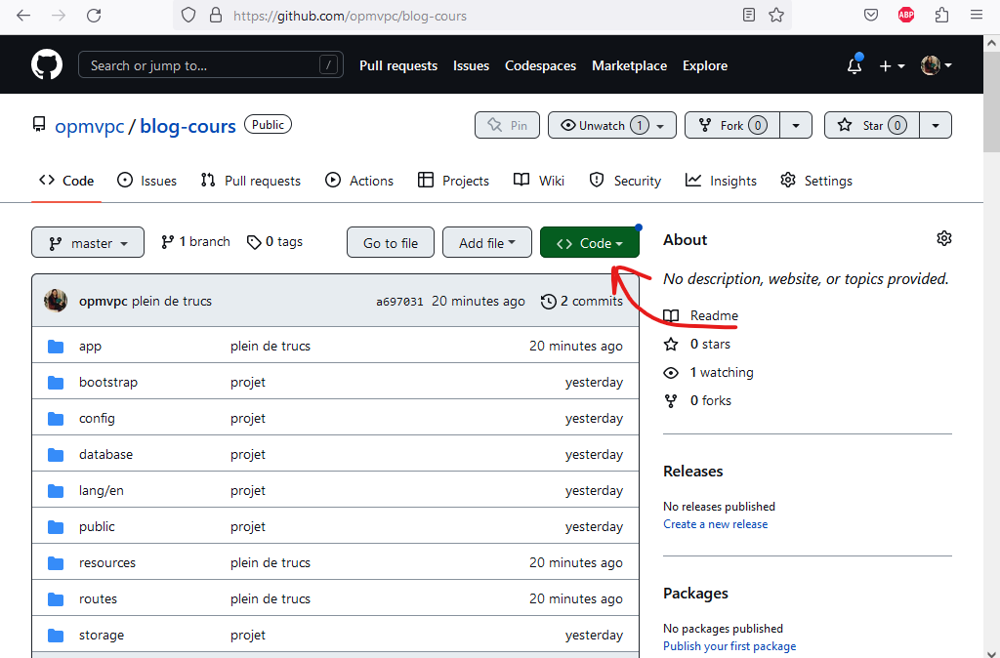
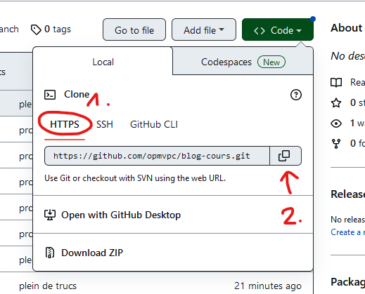
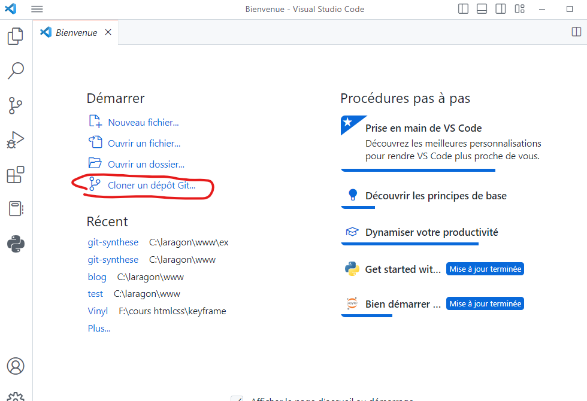
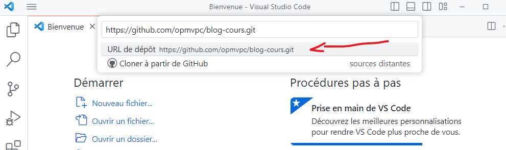
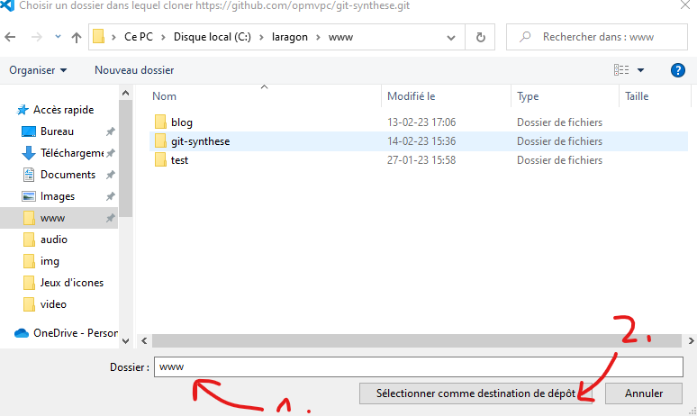
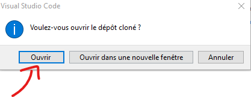

# Synthèse GIT

## Comment récupérer un repository sur notre machine

1. Allez sur github [github.com](https://github.com)
2. Allez sur la page du projet que vous voulez télécharger (ex: [https://github.com/opmvpc/blog-cours](https://github.com/opmvpc/blog-cours))
3. Cliquez sur le bouton "code" en vert

4. Choississez HTTPS puis le bouton pour copier le lien
   
5. Ouvrez une nouvelle fenêtre de visual studio code et cliquez sur "Cloner un dépot sur..."
   
6. Collez l'url dans le popup et sélectionnez "[lien] url du dépot"
   
7. VS code vous propose de choisir l'endroit ou télécharger le code. On va sélectionner notre dossier "www" de laragon.
   
8. Cliquez sur "ouvrir"
   
9. C'est gagné!

## Update du projet Laravel

Attention, le code des dépendances n'est pas enregistré dans git! On doit maintenant installer les dépendaces PHP et Javascript.

1. `composer update`
2. `npm i` alias de `npm install`
3. `npm run dev` dans un 2e terminal
4. Créer un fichier `.env`en copiant le fichier `.env.example`
5. Générer la clé d'encryption `php artisan key:generate`
6. Modifier le `.env` pour indiquer les infos de connection à la base de données.
7. Lancer la migration et le seeding de la base de données `php artisan migrate:fresh --seed`
8. Créer le lien symbolique du dossier storage vers le dossier public `php artisan storage:link`
  